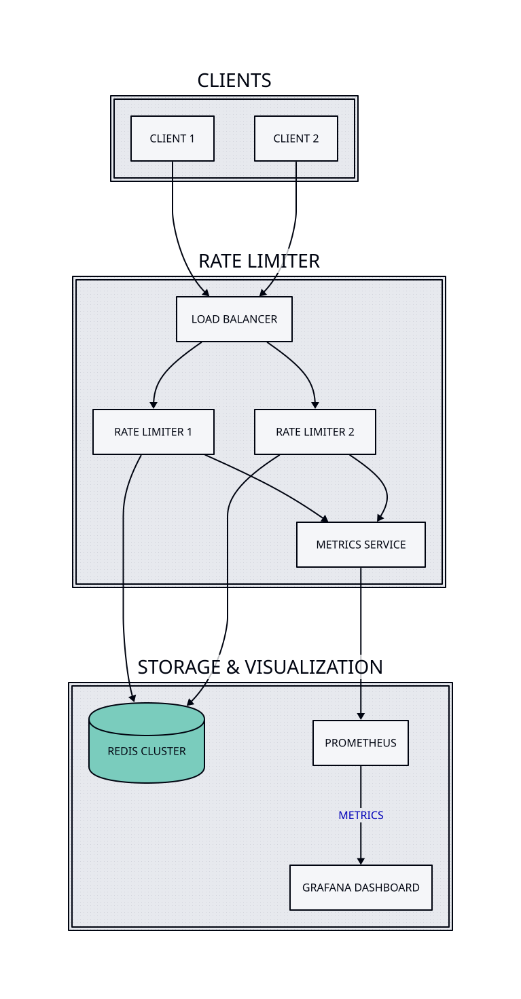

# Distributed Rate Limiter

A distributed rate limiter service built with Go, featuring Redis-backed storage and load balancing capabilities. The service also includes monitoring with Prometheus and Grafana.

## Features

- **Atomic sliding window rate limiting** using Redis Lua scripts (race-condition free)
- **Standard rate limit headers** (X-RateLimit-Limit, X-RateLimit-Remaining, X-RateLimit-Reset, Retry-After)
- **Circuit breaker pattern** for Redis failure resilience
- Distributed architecture with weighted load balancing
- Prometheus metrics with request latency histograms
- Graceful shutdown handling
- Docker containerization
- Comprehensive test suite (unit, integration, and load tests)
- Configurable rate limits, time windows, and Redis connection pools

## Architecture



The system consists of several components:

- **Rate Limiter Service**: Implements the core rate limiting logic using an atomic sliding window algorithm
- **Load Balancer**: Distributes traffic across multiple rate limiter instances with weighted routing
- **Redis**: Stores rate limiting data and enables distributed coordination
- **Prometheus**: Collects and stores metrics
- **Grafana**: Visualizes metrics and provides monitoring dashboards

## Prerequisites

- Docker and Docker Compose
- Go 1.22 or later (for local development)
- Redis (automatically handled by Docker Compose)

## Quick Start

1. Clone the repository:
   ```bash
   git clone https://github.com/stemitom/rate-limiter.git
   cd rate-limiter
   ```

2. Start the services:
   ```bash
   ./run.sh
   ```

This will start:
- Two rate limiter instances (`::8081`, `::8082`)
- Load balancer (`::8080`)
- Redis (`::6379`)
- Prometheus (`::9090`)
- Grafana (`::3000`)

## Configuration

### Rate Limiter Service

| Variable | Description | Default |
|----------|-------------|---------|
| `PORT` | Service port | `8081` |
| `REDIS_ADDR` | Redis address | `localhost:6379` |
| `RATE_LIMIT` | Requests per window | `10` |
| `WINDOW_SIZE` | Time window duration | `1s` |
| `REDIS_POOL_SIZE` | Redis connection pool size | `100` |
| `REDIS_MIN_IDLE_CONNS` | Minimum idle connections | `10` |
| `REDIS_DIAL_TIMEOUT` | Connection timeout | `5s` |
| `REDIS_READ_TIMEOUT` | Read operation timeout | `3s` |
| `REDIS_WRITE_TIMEOUT` | Write operation timeout | `3s` |

### Load Balancer

| Variable | Description | Default |
|----------|-------------|---------|
| `BACKEND_1_URL` | First backend URL | `localhost:8081` |
| `BACKEND_2_URL` | Second backend URL | `localhost:8082` |
| `BACKEND_1_WEIGHT` | Traffic weight for first backend | `2` |
| `BACKEND_2_WEIGHT` | Traffic weight for second backend | `1` |

## Rate Limit Response Headers

Every response includes rate limit information:

```
X-RateLimit-Limit: 10          # Maximum requests per window
X-RateLimit-Remaining: 7       # Requests remaining in current window
X-RateLimit-Reset: 1705123456  # Unix timestamp when window resets
```

When rate limited (429 status):
```
Retry-After: 1                 # Seconds until retry is allowed
```

## Testing

Run the test suite:
```bash
./scripts/test.sh
```

Run unit tests only:
```bash
go test ./internal/limiter/... -v
```

Run integration tests (requires Redis):
```bash
go test ./internal/limiter/... -tags=integration -v
```

## Load Testing

The project includes a load testing tool that can be used to benchmark the rate limiter:

```bash
go run cmd/loadtest/main.go -rps 100 -duration 10s -url http://localhost:8080
```

Parameters:
- `-rps`: Requests per second
- `-duration`: Test duration
- `-url`: Target URL

## Monitoring

- Grafana Dashboard: http://localhost:3000 (default credentials: admin/admin)
- Prometheus: http://localhost:9090

### Available Metrics

**Rate Limiter:**
- `http_requests_total` - Total HTTP requests by status
- `http_request_duration_seconds` - Request latency histogram
- `rate_limit_hits_total` - Total rate limit violations
- `redis_operation_duration_seconds` - Redis operation latency

**Load Balancer:**
- `load_balancer_requests_total` - Requests by backend and status
- `load_balancer_request_duration_seconds` - Request latency by backend
- `load_balancer_backend_healthy` - Backend health status (1=healthy, 0=unhealthy)

## API Endpoints

| Endpoint | Description |
|----------|-------------|
| `GET /` | Main endpoint for rate-limited requests |
| `GET /health` | Health check endpoint (includes Redis connectivity) |
| `GET /metrics` | Prometheus metrics endpoint |

### Health Check Response

```json
{
  "status": "healthy",
  "redis": "connected"
}
```

## Circuit Breaker

The rate limiter includes an optional circuit breaker pattern for Redis failures:

```go
import "github.com/stemitom/rate-limiter/internal/limiter"

rl := limiter.NewResilientRateLimiter(
    redisClient,
    10,                    // rate limit
    time.Second,           // window
    5,                     // failure threshold
    2,                     // success threshold
    30*time.Second,        // circuit timeout
)
```

States:
- **Closed**: Normal operation
- **Open**: After N consecutive failures, fails fast without calling Redis
- **Half-Open**: After timeout, allows test requests to check if Redis recovered

## License

This project is licensed under the MIT License - see the [LICENSE](LICENSE) file for details.
